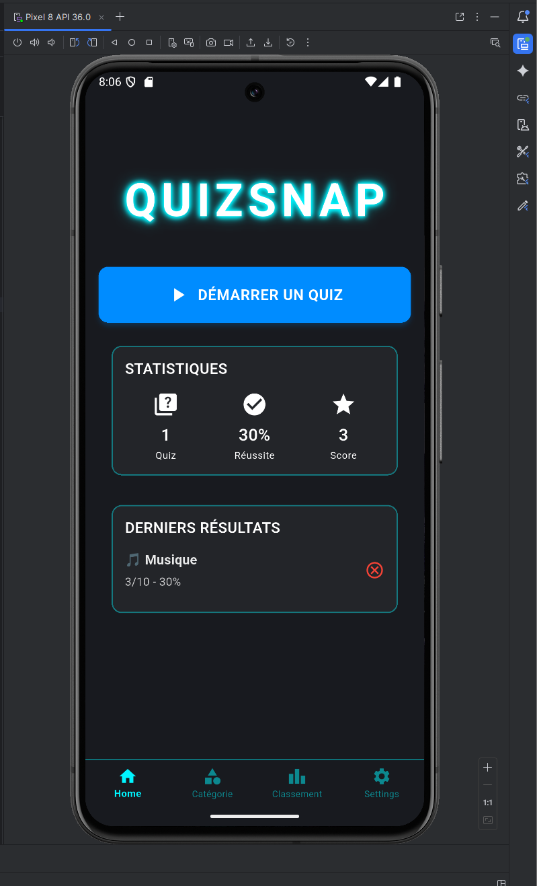

# QuizSnap



Application mobile de quiz interactive avec statistiques.

---

## Description

### À quoi sert l'application ?

QuizSnap est une application de quiz minimaliste conçue pour tester 
votre culture général

### Fonctionnalités principales

- **Quiz par catégorie** : Plus de 8000 questions réparties dans 10 catégories principales
- **Niveaux de difficulté** : 3 niveaux (Facile, Moyen, Difficile) à
- **Statistiques** : 
  - Score global et moyenne globale
  - Statistiques par catégorie
  - Historique 
- **Persistance des données** : Toutes les statistiques sont sauvegardées et persistent entre les sessions
- **Interface minimaliste** : Interface minimaliste style Neon
- **Multi-plateforme** : Fonctionne sur Android, iOS, Web, Windows, Linux et macOS

### Public cible

- Amateurs de quiz et de culture générale
- Personnes cherchant un divertissement éducatif

---

## Architecture MVVM

QuizSnap utilise l'architecture **MVVM** (Model-View-ViewModel) avec le pattern **Provider** pour la gestion d'état. 

### Vue d'ensemble de l'architecture

L'application est structurée en trois couches principales :

1. **View** : Les écrans et widgets UI (`lib/screens/`, `lib/widgets/`)
2. **ViewModel** : La gestion d'état et la logique de présentation (`lib/providers/`)
3. **Model** : Les classes de données (`lib/models/`)

Les **Services** (`lib/services/`) contiennent la logique métier et l'accès aux données, utilisés par les ViewModels.

### Flux de données

Le flux de données suit ce pattern :

1. **View → ViewModel** : L'utilisateur interagit avec l'interface (ex : bouton)
2. **ViewModel → Service** : Le ViewModel appelle un service pour traiter la demande
3. **Service → Model** : Le service manipule ou récupère des données (Models)
4. **ViewModel → View** : Le ViewModel notifie la View des changements via `notifyListeners()`
5. **View se met à jour** : L'interface se met à jour automatiquement grâce au `Consumer`

### Rôle de chaque dossier

#### `lib/models/` - Models (Données)
Contient les classes de données pures qui représentent les entités de l'application :
- `QuestionModel` : Modèle de question avec options, réponse correcte, explication
- `Category` : Modèle de catégorie avec nom et nombre de questions
- `QuizResult` : Résultat d'un quiz (score, réponses correctes, date)
- `UserScore` : Score total de l'utilisateur
- `GameMode` : Enum pour les modes de jeu (rapide, marathon, survie, défi quotidien)

#### `lib/providers/` - ViewModels (Gestion d'état)
**Note importante :** Dans ce projet, les ViewModels sont nommés `providers/` , car dans l'énoncé original du professeur M. Rehouma c'était demandé ainsi, mais ils remplissent exactement le rôle de ViewModels dans l'architecture MVVM. 

- `QuizProvider` : Gère l'état du quiz en cours (questions, réponses, progression)
- `UserProvider` : Gère les données utilisateur (scores, historique)

#### `lib/screens/` - Views (Interface utilisateur)
**Note importante :** Les Views sont nommées `screens/` dans ce projet, car dans l'énoncé original du professeur M. Rehouma c'était demandé ainsi, mais représentent les composants View de l'architecture MVVM.

- `HomeScreen` : Écran d'accueil avec navigation
- `CategorySelectionScreen` : Sélection de catégorie et difficulté
- `GameModeSelectionScreen` : Choix du mode de jeu
- `QuizScreen` : Écran principal du quiz
- `ResultScreen` : Affichage des résultats
- `LeaderboardScreen` : Statistiques et classement
- `SettingsScreen` : Paramètres de l'application

#### `lib/services/` - Services (Logique métier)
Services réutilisables qui contiennent la logique métier et l'accès aux données :
- `LocalDataService` : Chargement des questions depuis les fichiers JSON
- `StorageService` : Persistance des données avec SharedPreferences
- `QuizService` : Calcul de scores et création de résultats
- `CategoryService` : Gestion et classification des catégories
- `QuestionFilterService` : Filtrage des questions
- `JsonParserService` : Parsing et nettoyage des fichiers JSON
- `QuestionConverterService` : Conversion du format OpenQuizzDB

#### `lib/widgets/` - Widgets réutilisables
Composants UI réutilisables :
- `AnswerButton` : Bouton de réponse
- `CategoryCard` : Carte de catégorie
- `QuestionCard` : Carte de question
- `ScoreDisplay` : Affichage du score

#### `lib/utils/` - Utilitaires
Fonctions et constantes utilitaires :
- `constants.dart` : Constantes de l'application (couleurs, configurations)
- `helpers.dart` : Fonctions utilitaires (formatage, mélange)
- `theme.dart` : Configuration du thème visuel

### Communication entre les composants

#### View ↔ ViewModel (Provider)

La communication se fait via le pattern **Provider** avec `ChangeNotifier` :

**1. View écoute le ViewModel :**
```dart
// Dans un écran (View)
Consumer<QuizProvider>(
  builder: (context, quizProvider, child) {
    // La View se met à jour automatiquement quand le ViewModel change
    return Text('${quizProvider.questions.length} questions');
  },
)
```

**2. ViewModel notifie les changements :**
```dart
// Dans un Provider (ViewModel)
class QuizProvider with ChangeNotifier {
  List<Question> _questions = [];
  
  Future<void> loadQuestions() async {
    _questions = await LocalDataService.getRandomQuestions();
    notifyListeners(); // Notifie toutes les Views qui écoutent
  }
}
```

**3. View appelle le ViewModel :**
```dart
// Dans un écran (View)
onPressed: () {
  context.read<QuizProvider>().loadQuestions();
}
```

#### ViewModel ↔ Model

Les ViewModels utilisent directement les Models :
```dart
// ViewModel utilise Model
class QuizProvider {
  List<QuestionModel> _questions = []; // Utilise QuestionModel
  
  QuizResult? _result; // Utilise QuizResult
}
```

#### ViewModel ↔ Service

Les ViewModels appellent les Services pour la logique métier :
```dart
// ViewModel appelle Service
class QuizProvider {
  final QuizService _quizService = QuizService();
  
  void finishQuiz(String category) {
    _result = _quizService.createResult(
      questions: _questions,
      userAnswers: _userAnswers,
      category: category,
    );
  }
}
```

---

## Installation et lancement

### Prérequis

- Flutter SDK 3.9.2 ou supérieur
- Dart SDK 3.9.2 ou supérieur
- Un émulateur Android/iOS ou un appareil physique

### Installation

1. Cloner le repository :
```bash
git clone <url-du-repository>
cd QuizSnap/quizsnap
```

2. Installer les dépendances :
```bash
flutter pub get
```

### Lancement

#### Web (Développement)
**Important :** Utilisez un port fixe pour que les statistiques persistent entre les sessions :

```bash
flutter run -d chrome --web-port=8080
```

Ou utilisez les scripts fournis :
- Windows : `run_web.bat`
- Linux/Mac : `run_web.sh`

#### Android
```bash
flutter run -d android
```

#### iOS (sur Mac)
```bash
flutter run -d ios
```

#### Autres plateformes
```bash
# Windows
flutter run -d windows

# Linux
flutter run -d linux

# macOS
flutter run -d macos
```

---

## Fonctionnement

### Comment utiliser l'application ?

1. **Démarrage** : L'application s'ouvre sur l'écran d'accueil (`HomeScreen`)
2. **Sélection de catégorie** : 
   - Naviguer vers l'onglet "Catégorie"
   - Choisir une catégorie (ex: Musique, Cinéma, Sport)
   - Sélectionner un niveau de difficulté (Facile, Moyen, Difficile)
3. **Choix du mode de jeu** : Sélectionner un mode (Rapide, Marathon, Survie, Défi Quotidien)
4. **Répondre aux questions** : 
   - Lire la question
   - Sélectionner une réponse parmi les 4 options
   - Passer à la question suivante
5. **Voir les résultats** : 
   - Score affiché à la fin du quiz
   - Statistiques mises à jour automatiquement
6. **Consulter les statistiques** : 
   - Naviguer vers l'onglet "Classement"
   - Voir les statistiques globales, par catégorie, et l'historique

### Navigation entre les écrans

```
HomeScreen
  ├─> CategorySelectionScreen (via onglet "Catégorie")
  │     └─> GameModeSelectionScreen
  │           └─> QuizScreen
  │                 └─> ResultScreen
  │                       └─> HomeScreen (retour)
  │
  ├─> LeaderboardScreen (via onglet "Classement")
  │     └─> 3 onglets : Global / Catégories / Historique
  │
  └─> SettingsScreen (via onglet "Settings")
        └─> Options de réinitialisation des données
```

### Fonctionnalités clés

#### Gestion des questions
- Chargement automatique depuis 169 fichiers JSON
- Filtrage par catégorie et difficulté
- Mélange aléatoire des questions
- Cache pour optimiser les performances

#### Système de scoring
- Calcul automatique du score
- Précision globale
- Meilleur score par catégorie
- Historique complet avec dates

#### Persistance des données
- Sauvegarde automatique après chaque quiz
- Données persistantes entre les sessions
- Utilisation de SharedPreferences (Android/iOS) ou localStorage (Web)

---

## Équipe

### Membres du projet


- **Nom complet** : [Jean-François Lefebvre]
  - Rôle : [Développement / Architecture / Tests / Documentation]
  - Email : [ijipop82@gmail.com]


---

## Technologies utilisées

### Framework et langage

- **Flutter** : SDK 3.9.2
- **Dart** : 3.9.2

### Packages Flutter (pub.dev)

| Package | Version | Usage |
|---------|---------|-------|
| `provider` | ^6.1.1 | Gestion d'état MVVM (ViewModels) |
| `shared_preferences` | ^2.2.2 | Stockage local persistant |
| `fl_chart` | ^0.66.0 | Graphiques pour statistiques |
| `confetti` | ^0.7.0 | Animations de célébration |

### Packages pour MVVM

- **provider** : Pattern Provider avec `ChangeNotifier` pour implémenter les ViewModels
  - `ChangeNotifier` : Classe de base pour les ViewModels
  - `Consumer` : Widget pour écouter les changements dans les Views
  - `MultiProvider` : Injection de dépendances pour les ViewModels

### Plateformes supportées

- ✅ Android
- ✅ iOS
- ✅ Web
- ✅ Windows
- ✅ Linux
- ✅ macOS

---

## Défis et solutions

### Problème #1 : Récupération des ID des questions selon leur niveau de difficulté

**Contexte :** Les fichiers JSON contiennent 3 niveaux (débutant, confirmé, expert) avec des questions numérotées de 1 à 30. Il fallait mapper ces niveaux vers 3 difficultés (Facile, Moyen, Difficile).

**Solution :** La difficulté est déterminée directement depuis l'ID de la question :
- ID 1-10 → difficulté "easy" (Débutant)
- ID 11-20 → difficulté "medium" (Confirmé)
- ID 21-30 → difficulté "hard" (Expert)

**Implémentation :** Dans `question_converter_service.dart`, extraction de l'ID depuis `questionData['id']` et détermination automatique de la difficulté.

### Problème #2 : Rétention des données entre les sessions de jeux

**Contexte :** Il fallait sauvegarder les scores, l'historique des quiz et les statistiques utilisateur de manière persistante.

**Solution :** Utilisation de SharedPreferences avec sérialisation JSON :
1. Sérialisation des modèles via `toJson()`
2. Sauvegarde dans SharedPreferences avec des clés uniques
3. Chargement et désérialisation via `fromJson()`
4. Vérification immédiate après chaque sauvegarde

**Implémentation :** Service `StorageService` qui gère toute la persistance avec vérification automatique.

### Problème #3 : Chargement de 169 fichiers JSON

**Contexte :** Charger efficacement 169 fichiers JSON contenant plus de 4000 questions.

**Solution :** 
- Cache des questions chargées
- Parsing asynchrone
- Gestion d'erreurs pour ne pas bloquer le chargement si un fichier est corrompu
- Filtrage insensible à la casse pour les noms de dossiers

**Implémentation :** `LocalDataService` avec cache et gestion d'erreurs robuste.

---

## Structure du repository

```
quizsnap/
├── lib/
│   ├── models/          # Classes Model (données)
│   ├── providers/      # Classes ViewModel (gestion d'état)
│   ├── screens/         # Écrans et widgets (Views)
│   ├── services/        # Services externes (API, storage)
│   ├── utils/           # Utilities, constants
│   └── main.dart        # Point d'entrée
├── assets/
├── test/
│   ├── viewmodels_test/ # Tests des ViewModels
│   └── widget_test.dart
├── pubspec.yaml
├── README.md
└── data/
    └── quiz_Json/       # 169 fichiers JSON de questions
```

---

## Ressources supplémentaires

- [Documentation Flutter](https://docs.flutter.dev/)
- [Provider Package](https://pub.dev/packages/provider)
- [Architecture MVVM en Flutter](https://docs.flutter.dev/development/data-and-backend/state-mgmt/options#provider)

---

## Licence

[À compléter selon les besoins du projet]
